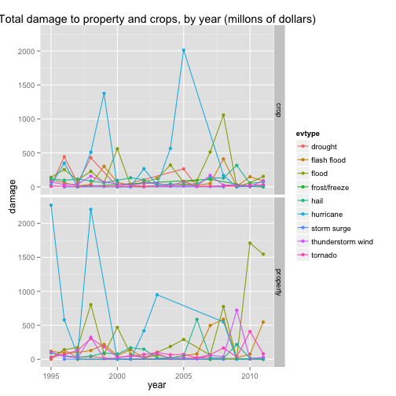

Weather Events With the Greatest Impact on Health and Economics
===============================================================
## Synopsis
With the aim of identifying which sever weather events are most harmful to human health and those with the greatest economic consequences, we explore the NOAA storm database, using data on weather-related deaths and injuries, and weather-related property and crop damage (measured in dollars). 
Our approach is to deal with these two consequences (on health and on the economy) separately. We measure the mean and total deaths, injuries, property damage, and crop damage, over the period 1995-2011, by type of severe weather event (as provided by the National Weather Service), in order to account not only for impact, but also for frequency of each event. 
The following analysis provides an outline of the most harmful event types on this basis. 

## Data Processing

```r
library(dplyr)
library(lubridate)
library(stringr)
library(tidyr)
library(ggplot2)
library(gridExtra)
```


```r
Url  <- "https://d396qusza40orc.cloudfront.net/repdata%2Fdata%2FStormData.csv.bz2"
download.file(Url,destfile = "stormdata.csv.bz2", method="curl")
df <- read.csv(bzfile("stormdata.csv.bz2"), stringsAsFactors = FALSE)
df <- tbl_df(df)
```


```
## Warning: NAs introduced by coercion
```

```
## Warning: NAs introduced by coercion
```

From the initial dataset, we select the varaibles of interest: year, state, event type, fatalities, injuries crop and property damage, and their associated exponent columns. 
To decide which year to set the cutoff at, we can look at the distinct event types which occur in the years 1994 and 1995. To make the cleaning easier, we will start with data from 1995.


```
## Source: local data frame [1 x 2]
## 
##   year unique
## 1 1995    387
```


We then begin by looking at the most fatal events, as well as the events which appear to have a high average fatality rate, paying attention to the count, and comparing the names of these events to those provided in the codebook provided by the NWS. In this way, we replace the incorrect event type names with correct ones, and then refer again to the fatality rankings after computing with the new, correct names. 
There are about 30 replacements in total. 

It's clear that certain events occur far more often than others, and that there are clearly ones which greatly affect human health. It is also clear that certain events are more common and dangerous in certain areas of the country. Using the longitude and latitude data provided for (some of) the event types, we can look at the relative intensity and frequency of some events since 1995.

 
From these plots of event types which caused at least more than one injury (and where longitude and latitude data was recorded), we can see that hail, for example, is less harmful than lightning, thunderstorm wind, or tornado.
This is, however, not the entire picture, as the location of certain events like excessive heat or cold can not be reduced to a particular location. 


```r
health <- select(dat, state, evtype, fatalities, injuries, year)%>%
                filter(fatalities>0|injuries>0)%>%
                arrange(desc(fatalities), desc(injuries))%>%
                group_by(evtype)%>%
                summarize(count=n(),
                            mean_death=mean(fatalities),
                            total_death=sum(fatalities),
                            mean_inj=mean(injuries),
                            total_inj=sum(injuries))%>%
                                filter(count>10)%>% ## to account for misnaming
                                arrange(desc(mean_death))
```

Using one of the same tables as were used to identify the most important incorrect event names, (health) which filters the data by severity of event (deaths and injuries), and which not only calculates total damage to human health, but also takes into account the mean deaths and injuries of each event type, we can easily extract the most harmful events. 


```r
total_death20 <- health%>%
                arrange(desc(total_death))%>%
                select(evtype, total_death, mean_death)%>%
                slice(1:20)
total_injury20 <- health%>%
                arrange(desc(total_inj))%>%
                select(evtype, total_inj, mean_inj)%>%
                slice(1:20)
```

We take the 20 events with the highest total fatalaties and highest total injuries, and merge them into a dataset to extract the events which make both lists. 

```r
top20_health_merged <- merge(total_death20, total_injury20, by="evtype")
```


We do the same transformation of the data set for economic impact. Selecting years, event type, (non-zero) property damage varaibles, and (non-zero) crop damage variables (which are combined to get a single dollar figure for each observation) we group by event type and year. From this dataset a separate dataset is created for property damage and for crop damage. Each new dataset is summarised to count total and mean damage per event. 


```r
econ <- select(dat, year, evtype, propdmg, propdmgexp, cropdmg, cropdmgexp)%>%
        mutate(property=propdmg*propdmgexp, crop=cropdmg*cropdmgexp)%>%
        select(evtype, year, property, crop)%>%
        filter(property>1&crop>1)%>%
        arrange(desc(property), desc(crop))%>%
        group_by(evtype, year)%>%
        summarize(count=n(),
                  mean_prop=mean(property),
                  mean_crop=mean(crop),
                  total_prop=sum(property),
                  total_crop=sum(crop))
```


Once the most severe weather events (top mean property damage and top mean crop damage) are determined with these two tables, we pinpoint the events where there is severe crop damage but no property damage (frost/freeze and drought, in the top 5), and where there is severe property damage but no crop damage (storm surge, in the top 2). The final list, then, includes the top 6 most severe weather events on property and crops combined, plus the three events associated with only one of the two indicators of economic damage. 


```r
econ_merged <- merge(econ_crop, econ_property, by="evtype")%>%
        mutate(total = total_crop+total_prop)%>%
        arrange(desc(total))
```


## Results

We can see from the list of merged events (top 20 causes of injury and top 20 causes of death) that tornado and thunderstorm wind, as examined earlier, indeed make the top 14 weather events. It is also evident that several of these events are similar. ("high wind," "thunderstorm wind," and "hurricane", for example.)


```r
top20_health_merged
```

```
##               evtype total_death mean_death total_inj   mean_inj
## 1     excessive heat        2188  3.0304709      7073  9.7963989
## 2        flash flood         950  1.0614525      1739  1.9430168
## 3              flood         452  1.0560748      6849 16.0023364
## 4               heat         924  4.6903553      2030 10.3045685
## 5         heavy snow         115  0.6927711       751  4.5240964
## 6          high wind         252  0.4483986      1200  2.1352313
## 7          hurricane         128  2.1333333      1322 22.0333333
## 8          ice storm          84  0.9545455       357  4.0568182
## 9          lightning         729  0.2491456      4631  1.5827068
## 10       rip current         564  0.9009585       524  0.8370607
## 11 thunderstorm wind         415  0.1670020      5622  2.2623742
## 12           tornado        1545  0.7413628     21765 10.4438580
## 13          wildfire          87  0.2628399      1456  4.3987915
## 14      winter storm         195  0.8823529      1298  5.8733032
```

```r
ggplot(data = healthmerged, aes(x=evtype, y=total, fill=health_type))+geom_bar(stat="identity")+theme(axis.text.x = element_text(angle = 45, hjust = 1))+ggtitle("total fatalities and injuries by extreme weather events, 1995-2011")+xlab("weather event")+ylab("total injuries and fatalities")
```

 
The plot shows the total deaths and injuries per event, over all years in the dataset. 


Here we can see the top 9 most destructive weather events by total damages (in millions of dollars)

```r
plotecon
```

```
## Source: local data frame [222 x 5]
## 
##         evtype year    group     total   damage
## 1      drought 1995 property      5000   0.0050
## 2      drought 1996 property 135400000 135.4000
## 3      drought 1997 property  24000000  24.0000
## 4      drought 1998 property  40000000  40.0000
## 5      drought 2000 property    508000   0.5080
## 6      drought 2005 property  10414000  10.4140
## 7      drought 2006 property  22305000  22.3050
## 8      drought 2011 property    100000   0.1000
## 9  flash flood 1995 property 118464232 118.4642
## 10 flash flood 1996 property  89159000  89.1590
## ..         ...  ...      ...       ...      ...
```

With outliers removed we can see a time series of these events: 

```r
qplot(year, damage, data=plotecon, 
      geom=c("point", "line"), group=evtype, 
      facets=group~., color=evtype, 
      main="Total damage to property and crops, by year (millons of dollars)")
```

 
