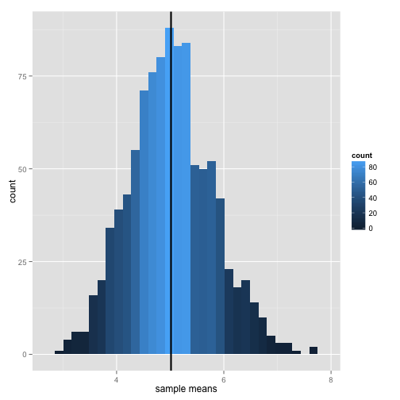
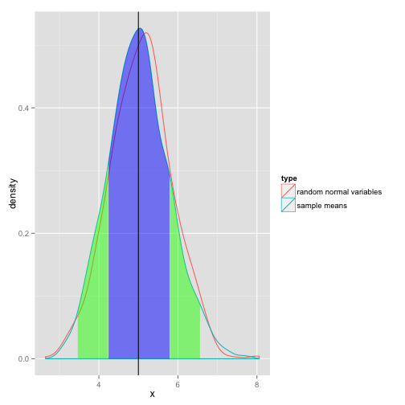

The Central Limit Theorem: Simulation of the Exponential Distribution
======================================================================

# Overview
In this investigation we will compare the results of a simulation, sampling 1000 means of 40 exponentials from the exponential distribution. 
We will then compare the parameters of our simulation to the theoretical parameters of the exponential distribution. 
For all of our simulations we will use a lambda of 0.2

# Simulations

We simulate the exponential distribution: we take the mean of 40 random exponential variables 1000 times.


## Sample mean, compared to the theoretical mean of the distribution
 

The vertical black line on the above histogram counting the values of our sample means marks the mean of this distribution. **The theoretical mean of the exponential distribution is 5** (1/Lambda, here: 1/0.2).
The mean of the distribution of our simulated data appears to be very close to 5, and indeed **the mean of our simulated means is 5.015**

## Sample variance, compared to the theoretical variance of the distribution
The theoretical standard deviation of the distribution of the sample means is the **standard error**; this is the standard deviation of the exponential distribution (lambda; in our simulation this is 1/0.2), divided by the square route of the sample size. 
**The theoretical standard deviaiton is approximately 0.791**. Very close to this theoretical standard deviation, **the standard deviation of our simulation is about 0.778**. 
The variance of the distribution is simple the standard deviation squared, just as the sample variance is the sample standard deviation squared, **the two variances - sample and theoretical, remain very close at 0.625 (theoretical), and 0.603 (sample)**

## Is the distribution approximately normal?
In the plot below we simulate 1000 random normal variables (the same sample size as our original exponential means simulation) and plot the density function of this simulation over the density plot of the 1000 sample means of random exponentials. **The red curve represents the distribution of normal random varaibles, while the blue is the the density plot of our simulation** of sample means from the exponential distribution. 

 

We can observe that the two distributions are strikingly similar.  

To show that the distribution is approximately normal we can examine the assumption that 50% of observations lie above the mean, and 50% lie under the mean. From our simulated data there should therefore be about 500 (out of 1000) observations greater than the mean. In the diagram above the black line represents the median of the sample means.
In fact **there are 508 observations above the mean, and 492 observatons below it.** 

## Using the sample standard deviation to show normality in the distribution of sample means
Another feature of the normal distribution is that 68% of the observations lie within 1 standard deviation of the mean, and that 95% lie within 2 standard deviations of the mean. 
The above density plot verifies this in our distribution of sample means; we find that **68.8% of observations lie within one standard deviation of mean. 95.3% of observations in our sample lie within two standard deviations.** The vertical black line again indicates the mean of our simulated sample means.  

## Conclusion
Our investigation into the distribution of sample means from the exponential distribution demonstrates the Central Limit Theorem; when we take the mean of a sample of independent and identically distributed variables (the call to the command rexp() guarantees this), the distribution of means will become approximately normal as the size of the sample grows sufficiently large (even, as our choice of the exponential distribution proves, when the original distribution from which the samples are drawn is not itself normal). The sample size here of n=1000 is indeed sufficient to demonstrate the Central Limit Theorem empirically. 
\pagebreak

Appendix
================

# Simulations

```r
library(ggplot2)
library(scales)
```

## simulating the means of 40 exponential variables 1000 times

```r
lambda <- 0.2
exps = NULL
set.seed(24)
for (i in 1:1000) exps = c(exps, mean(rexp(40, 0.2)))
exps <- data.frame(x=exps)
```

## Sample mean, compared to the theoretical mean of the distribution

```r
# plot to show the count of each mean value in the 1000 simulations
ggplot(exps, aes(x = x)) + geom_histogram(aes(fill=..count..))+
        geom_vline(xintercept = mean(exps$x), colour = "black", size=1)+
        xlab("sample means")
```

```r
mean(exps$x)
```

```
## [1] 5.015078
```

## Sample variance, compared to the theoretical variance of the distribution

```r
lambda <- 0.2 
n <- 40
theoreticalSD <- (1/lambda)/sqrt(40) 
sampleSD <- sd(exps$x)
setNames(c(theoreticalSD, sampleSD), c("theoretical", "sample")) 
```

```
## theoretical      sample 
##   0.7905694   0.7777071
```

```r
# table compares theoretical mean 1/Lambda, to the sample mean
```
\pagebreak

## Is the distribution approximately normal?

```r
# Two density plots, normal vs. sample means of exponential variables
nx <- data.frame(x=rnorm(1000, mean=5, sd=sd(exps$x)), type="random normal variables")
exps$type <- "sample means" 
plotDensity <- rbind(exps, nx) # create a data frame of random variables, 
# half from the exponential distribution, half from the normal distribution, 
# with factor variable to describe them.
plotDensity$type <- as.factor(plotDensity$type)

ggplot(plotDensity, aes(x=x))+
        geom_density(aes(group=type, color=type))
```

```r
# how many observations of exponential means are above the mean of the distribution?
table(exps$x>mean(exps$x)) 
```

```
## 
## FALSE  TRUE 
##   508   492
```

```r
# what percentage of observations lie within one, two sd. of the mean?
sd <- sd(exps$x)
twosd <- 2*sd
mn <- mean(exps$x)

sdVect <- setNames(c((nrow(subset(exps, x<mn+sd & x>mn-sd)))/nrow(exps), # within 1 sd.
(nrow(subset(exps, x<mn+twosd & x>mn-twosd)))/nrow(exps)), c("one sd", "two sd")) # within 2 sd.
sdVect
```

```
## one sd two sd 
##  0.688  0.953
```


```r
# plot shading the areas under the bell curve delineated by one, two sd from mean

# create the data frame (means of means of 40 variables from normal and 
# exponential distribution), define mean and standard deviation of the exponential means.
nx <- data.frame(x=rnorm(1000, mean=5, sd=sd(exps$x)), type="random normal variables")
exps$type <- "sample means"
plotDensity <- rbind(exps, nx)
plotDensity$type <- as.factor(plotDensity$type)
mn <- mean(exps$x)
sd <- sd(exps$x)
dens <- density(exps$x)
dd <- with(dens,data.frame(x,y))

#define where 68% and 96% under the curve should theoretically start and end
mnsdPos <- mn+sd
mnsdNeg <- mn-sd
mnsdPos2 <- mn+(2*sd)
mnsdNeg2 <- mn-(2*sd)

# plot both normal and exponential samples density plots, shade +-1 and +-2 standard
# deviaitons from the mean of our simulation. 
ggplot(plotDensity, aes(x=x))+
        geom_density(aes(group=type, color=type))+
        geom_ribbon(data=subset(dd,x>mnsdNeg & x<mnsdPos),aes(ymax=y),ymin=0,
                    fill="blue",colour=NA,alpha=0.5)+
        geom_ribbon(data=subset(dd,x>mnsdPos & x<mnsdPos2),aes(ymax=y),ymin=0,
                    fill="green",colour=NA,alpha=0.5)+
        geom_ribbon(data=subset(dd,x>mnsdNeg2 & x<mnsdNeg),aes(ymax=y),ymin=0,
                    fill="green",colour=NA,alpha=0.5)+
        geom_vline(xintercept = median(exps$x), colour = "black")+
        xlab("x")+
        ylab("density")
```

