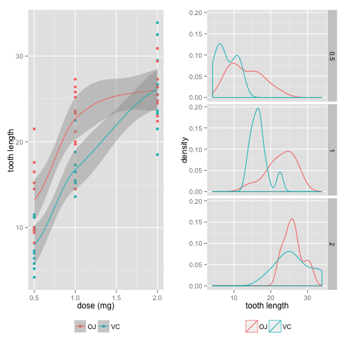
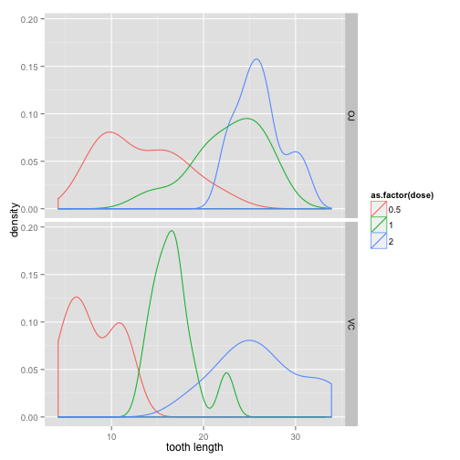

Tooth Growth Study
======================

# Summary of the Data
The data from this study attempts to identify the effect of Vitamin C on tooth growth in guinea pigs, given varying dosages (0.5, 1 or 2 milligrams) of two different supplements (orange juice or ascorbic acid.)

There are sixty observations; each dosage amount of each supplement was given to ten guinea pigs. The variable examined here will be the length of each guinea pig's teeth after administration, of the supplement. 

Exploratory analysis would suggest that there is indeed a positive relationship between increased doses of either supplement and tooth growth:

 

Perhaps the low sample size could account for the apparent difference in tooth growth at lower doses of the supplement types, while at the highest dosage the difference is not so obvious, as we see from the scatter plot on the right. 

The center of the tooth growth distributions split by dosage appear different at lower levels, though they converge at the 2mg dosage. The panels of density plots on the right break the data into dosage groups, where we see at 2mg of either supplement, the data is centered around the same point, though the distributions exhibit different variances. 

This would lead us to the hypothesis that dose makes a difference in tooth growth, especially in VC supplement.

 

#Hypothesis Testing

##Comparison of overall tooth growth by supplement
A t-test comparing the mean tooth growth returns a p-value of 0.06063, so we fail to reject the null hypothesis at the 95% confidence level, though just barely. A 95% confidence interval for the difference in means encompasses zero, at [-0.171, 7.571].

## The effects of using different supplements
With this result in mind, we examine the effect of different supplements at the same dosage only. We find that **the orange juice supplement is associated with greater mean tooth growth than ascorbic acid at doses of 0.5 and 1 mg.** These results confirm the impression given by exploratory plots of the previous section.

At the dosage of 0.5 we reject the hypothesis that the difference in tooth growth means is zero, in favor of the alternative, as a t-test returns a p-value of 0.006.We find an even more significant result when we look at the difference in the effect of supplements on tooth growth when the dosage rises to 1mg, (p-value = 0.001), giving an interval of the difference between 2.802 and  9.058 at the 95% confidence level. **At a dosage of 2mg however, the supplements appear to be equally effective,** as a t test for a difference in means returns a p-value of  0.9639. 

## The effects of using different dosages
Given our initial exploration of the data, we hypothesize a positive relationship between dosage of vitamin C and tooth growth in guinea pigs. 
        
A test for equal means of tooth growth associated with ascorbic acid supplements at 0.5 and 1mg returns a highly significant p-value of 6.811018e-07, as does a test of equal means at 1 and 2mg: 9.155603e-05. **We conclude that the three different dosages of ascorbic acid are associated with greater tooth growth.** 
We do not obtain the same results using orange juice supplements, however. Though we do see a difference in mean tooth growth comparing 0.5mg to 1mg dosages, (p-value = 8.784919e-05); we fail to reject the null hypothesis that the means are equal at 1mg and 2mg dosages (p-value=0.03919514). This would confirm the intuition provided by the scatter plot of the previous section; which shows that an increase in tooth growth drops off after 1mg. 

# Conclusion, Statement of Assumptions

We can conclude that there is indeed a non-trivial, positive relationship between increased dosages of Vitamin C and tooth growth, for both types of Vitamin C supplement. It is also evident that at lower dosages, Vitamin C supplements of ascorbic acid correlate with higher tooth growth than supplements of orange juice, though we can not make this claim at the 2mg dosage level. 
The assumptions underlying the Student's T-test and confidence intervals are firstly, that the data points are all identically and independently distributed. That is to say, we assume that each random variable has the same probability of outcome as all the others, and that no variable from the sample affects any other variable. Concretely we assume that the tooth length of one guinea pig does not affect the tooth length of any other guinea pigs. 
Additionally, we assume that the underlying distribution of the means of our samples (here 6: 3 dosage groups for both supplement types) is approximately normal. 

\pagebreak

Appendix
===========


```r
# data frames of supplement groups
VCdat <- dat%>%filter(supp=="VC")
OJdat <- dat%>%filter(supp=="OJ")
#data frames of dosage groups (Ascorbic Acid)
VC05 <- dat%>%arrange(dose)%>%filter(dose==0.5&supp=="VC")
VC1 <- dat%>%arrange(dose)%>%filter(dose==1&supp=="VC")
VC2 <- dat%>%arrange(dose)%>%filter(dose==2&supp=="VC")
#data frames of dosage groups (Orange Juice)
OJ05 <- dat%>%arrange(dose)%>%filter(dose==0.5&supp=="OJ")
OJ1 <- dat%>%arrange(dose)%>%filter(dose==1&supp=="OJ")
OJ2 <- dat%>%arrange(dose)%>%filter(dose==2&supp=="OJ")
```

```r
# t test comparing supplements at different dosage groups
CompSuppA <- t.test(OJ05$len, VC05$len, paired = FALSE, var.equal = FALSE)
CompSuppB <- t.test(OJ1$len, VC1$len, paired = FALSE, var.equal = FALSE)
CompSuppC <- t.test(OJ2$len, VC2$len, paired = FALSE, var.equal = FALSE)
CompSuppVals <- data.frame(rbind(CompSuppA[3:4], CompSuppB[3:4], CompSuppC[3:4]), 
                           row.names=c("Dose.5", "Dose 1", "Dose 2"))
CompSuppVals
```

```
##            p.value           conf.int
## Dose.5 0.006358607 1.719057, 8.780943
## Dose 1 0.001038376 2.802148, 9.057852
## Dose 2   0.9638516  -3.79807, 3.63807
```


```r
# difference of means given supplements, over dosage groups
CompDoseOJa <- t.test(OJ1$len, OJ05$len, paired = FALSE, var.equal = FALSE)
CompDoseOJb <- t.test(OJ2$len, OJ1$len, paired = FALSE, var.equal = FALSE)
CompDoseVCa <- t.test(VC1$len, VC05$len, paired = FALSE, var.equal = FALSE)
CompDoseVCb <- t.test(VC2$len, VC1$len, paired = FALSE, var.equal = FALSE)
CompDoseVals <- data.frame(rbind(CompDoseOJa[3:4], CompDoseOJb[3:4], 
                                 CompDoseVCa[3:4], CompDoseVCb[3:4]), 
        row.names=c("1mg OJ-.5mg OJ", "2mg OJ-1mg OJ", "1mg VC-.5mg VC", "2mg VC-1mg VC"))
CompDoseVals
```

```
##                     p.value             conf.int
## 1mg OJ-.5mg OJ 8.784919e-05  5.524366, 13.415634
## 2mg OJ-1mg OJ    0.03919514 0.1885575, 6.5314425
## 1mg VC-.5mg VC 6.811018e-07  6.314288, 11.265712
## 2mg VC-1mg VC  9.155603e-05  5.685733, 13.054267
```
